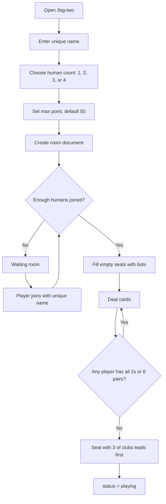
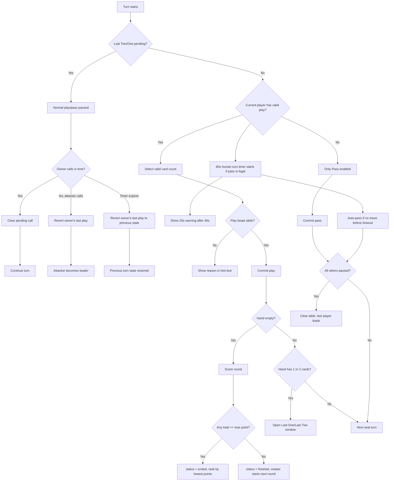
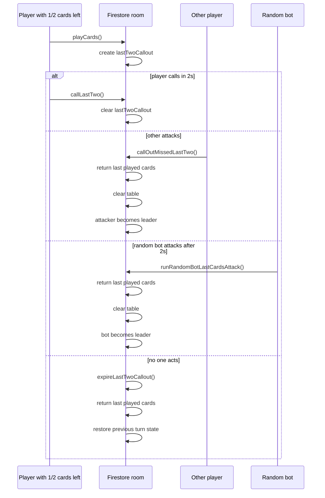
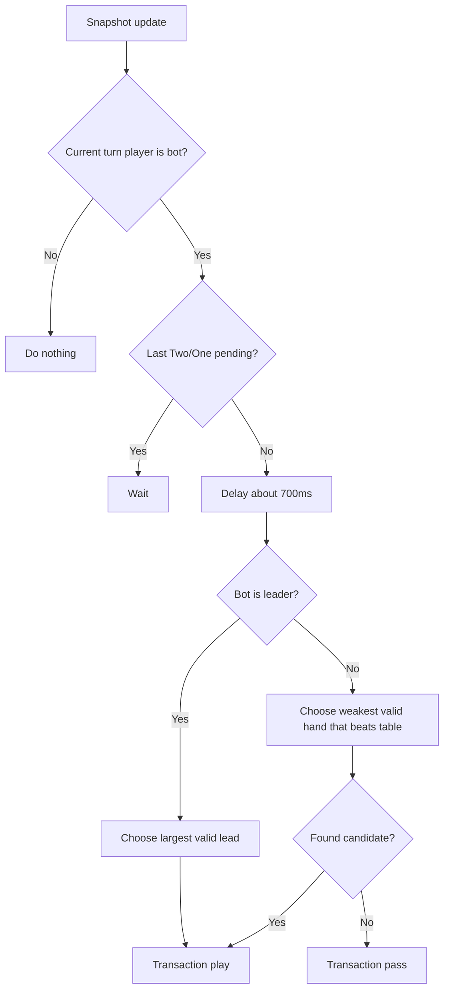
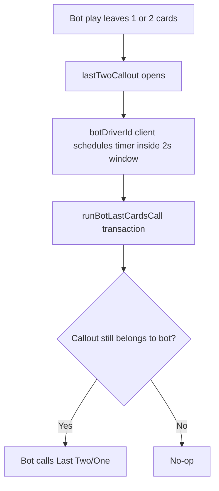
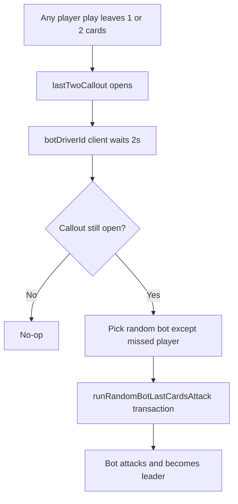

# Big Two Firebase Room

Realtime Big Two lives under `src/app/big-two`.

Main files:

- `page.js`: lobby, player name, room creation.
- `[room]/page.js`: room UI, Firestore snapshot listener, human actions, bot timers.
- `page.module.css`: table, hand dock, mobile layout.
- `src/components/big-two/bigTwoRules.js`: pure game rules and state transitions.
- `src/components/big-two/bigTwoFirebase.js`: Firestore reads, writes, and transactions.
- `src/components/big-two/data/data.js`: card ordering and image mapping.

## Firestore Room Shape

Collection: `bigTwoRooms`

Important fields:

```js
{
  roomId,
  targetHumans,          // 1, 2, 3, or 4
  maxPoint,              // point limit, default 50
  status,                // "waiting" | "playing" | "finished" | "ended"
  players,               // humans + bots after start
  botDriverId,           // creator client drives bot timers
  turnSeat,              // active seat number
  hands,                 // { [seat]: cardValue[] }
  lastPlay,              // current table play, null when leader can play anything
  passes,                // seats that passed against current lastPlay
  history,               // recent play/pass/callout entries
  winner,
  points,                // { [seat]: totalPoints }
  roundScores,           // latest round card counts and totals
  finalRanks,            // match-end ranking, lowest points first
  lastTwoCallout,        // pending Last Two/Last One window
  mustPlayThreeClubs,    // legacy field; first play does not require 3 of clubs
  createdAt,
  updatedAt,
  expiresAt              // Firestore TTL field
}
```

`expiresAt` is updated on every state change. Firebase Firestore TTL should be enabled for `bigTwoRooms.expiresAt` so old rooms are cleaned by Firebase.

## Card Order

Cards use numeric `value` from `data.js`.

Lowest card is `3 of clubs` with value `3`.
Highest card is `2 of spades`.

Suit order follows card value order:

```text
clubs < diamonds < hearts < spades
```

## Room Lifecycle



For `1` human, game starts immediately with `3` bots.

For `2` humans, seats alternate as human, bot, human, bot.

For `3` humans, game starts with `1` bot.

For `4` humans, game starts with no bots.

Initial deals are disqualified and redealt if any player has all four `2`s or at least `6` pairs.

## Turn Flow

All moves write through Firestore transactions.



Human turns auto-pass after `60s` when table has an active `lastPlay`. Current player sees a warning after `40s`: `Your turn will be auto passed in 20s.` Leader turns do not auto-pass because Big Two does not allow passing while leading.

## Play Validation

Validation is shared between UI and transaction rules.

Valid hand sizes:

- `1`: single
- `2`: pair
- `3`: three of a kind
- `5`: straight, flush, full house, four of a kind, straight flush, royal flush

When table has `lastPlay`, next play must match card count and beat it.

Examples:

- If table has single, only single can be selected.
- If table has pair, only pair can be selected.
- If table has five-card hand, only five-card hand can be selected.
- First player is the seat holding `3 of clubs`, but first play can be any valid Big Two hand.

Invalid selection hint comes from `getPlayBlockReason()`.

## Scoring And Game End

Room creator chooses `maxPoint` when creating room. Default is `50`.

When a player empties hand:

1. Round ends.
2. Each player's remaining card count is added to their total points.
3. Winner adds `0` because winner has no cards.
4. If any total reaches or crosses `maxPoint`, match ends.
5. Final ranking sorts players by lowest total points.

Room fields:

```js
points = {
  [seat]: totalPoints
}

roundScores = [
  {
    seat,
    name,
    cardCount, // remaining cards after round
    points,    // points gained this round
    total      // total points after round
  }
]

finalRanks = [
  {
    rank,
    seat,
    name,
    points
  }
]
```

When `status === "finished"`, creator sees `Next round`. This deals fresh cards and keeps `points`.

When `status === "ended"`, final card shows ranks and totals. Creator sees `New match`, which resets `points` and deals again.

## Last Two / Last One Rule

Whenever a player makes a play and has `2` or `1` cards left, room opens `lastTwoCallout`.

Despite name, `lastTwoCallout` stores both cases:

```js
{
  seat,
  playerId,
  name,
  remainingCount,              // 2 means Last Two, 1 means Last One
  cards,                       // cards from last play
  hand,
  previousLastPlay,
  previousPasses,
  previousTurnSeat,
  previousMustPlayThreeClubs,
  openedAt,
  expiresAt
}
```

Owner must click:

- `Last Two` when `remainingCount === 2`
- `Last One` when `remainingCount === 1`

Other players always see `Call Last Two/One` button. No public notification or banner is shown. Players must watch visible card counts.

If owner has not called after `2s`, creator client picks a random bot attacker, if available. That bot attacks and becomes leader.

Successful attack:

- missed player's last played cards return to hand
- table clears
- passes clear
- attacker becomes new leader
- pending call clears

Timer expiry without attacker:

- missed player's last played cards return to hand
- previous table state returns
- previous turn seat returns
- pending call clears



## Bot Logic

Only creator client (`botDriverId`) runs bot timers. This prevents every connected client from driving same bot.

Bot turn:



Bot play strategy:

1. When leading, bot scores valid single, pair, three-card, and five-card options.
2. Bot prefers shedding five-card hands, three of a kind, and pairs before singles.
3. Bot avoids breaking pairs/triples for low-value singles unless needed.
4. When answering table, bot uses an efficient winning play normally.
5. Bot spends stronger cards to take control when its hand is short, an opponent is low on cards, or one more pass can win trick.

If no beating play exists, bot passes.

Bot Last Two/One call:



Bot Last Two/One attack:



## UI Behavior

Room UI uses Firestore `onSnapshot`.

Important UI rules:

- Cards grey out when player has no valid play.
- If table needs single/pair/triple/five, selection count is capped to that size.
- Hint/reason appears above card rail.
- Played pile overlay shows latest play first.
- Only latest 4 played entries show player name and hand label.
- Older pile entries show cards only.
- `Call Last Two/One` is always enabled for human players.

## Cleanup

Room cleanup is Firebase-managed:

1. Room state writes `expiresAt = now + 48 hours`.
2. Enable Firestore TTL on collection group `bigTwoRooms`, field `expiresAt`.
3. Firebase deletes expired rooms asynchronously.

No Vercel cron is required.
